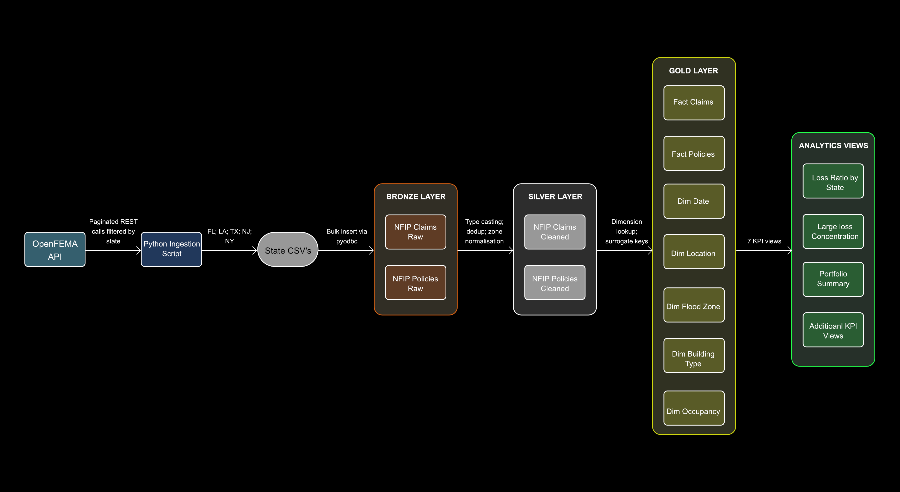
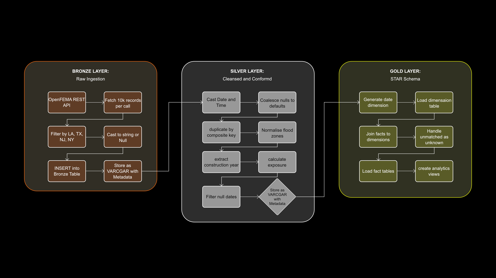
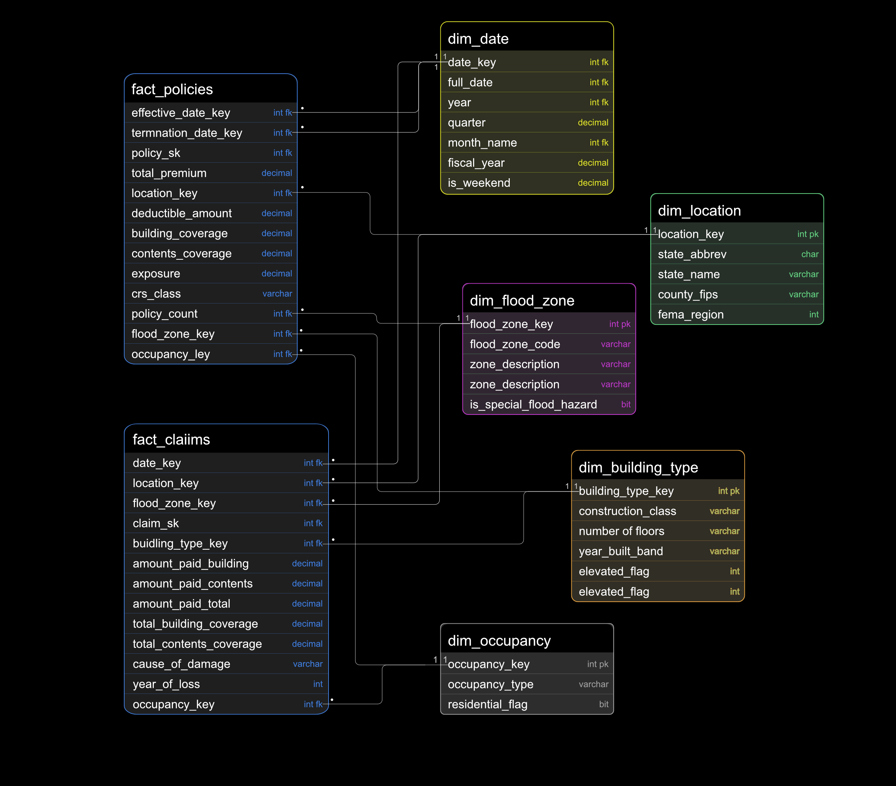
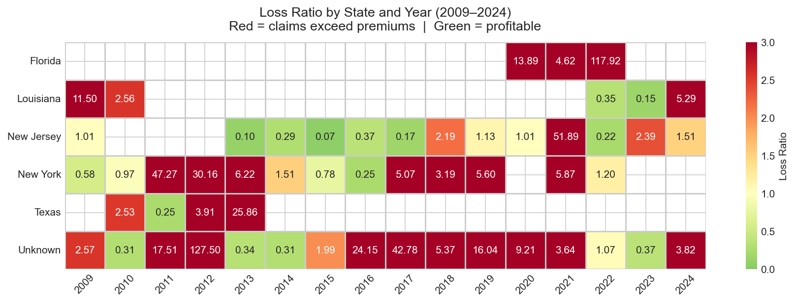
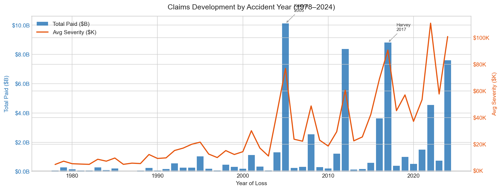
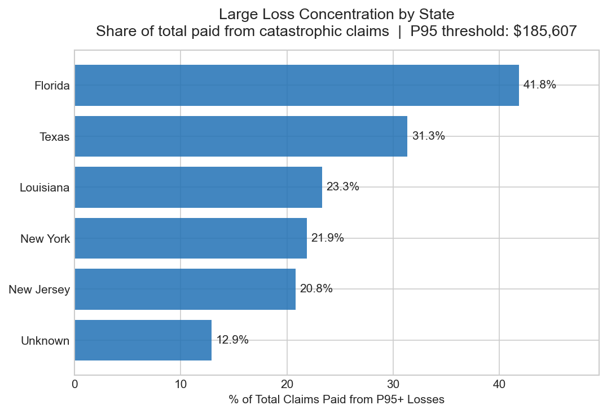
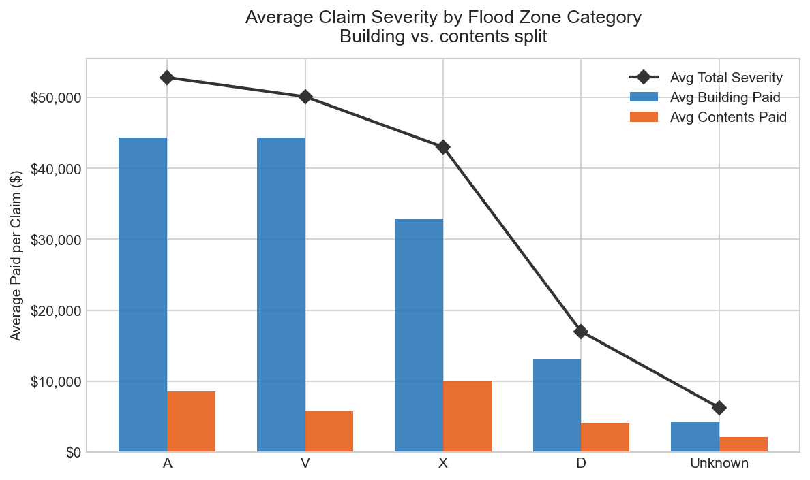
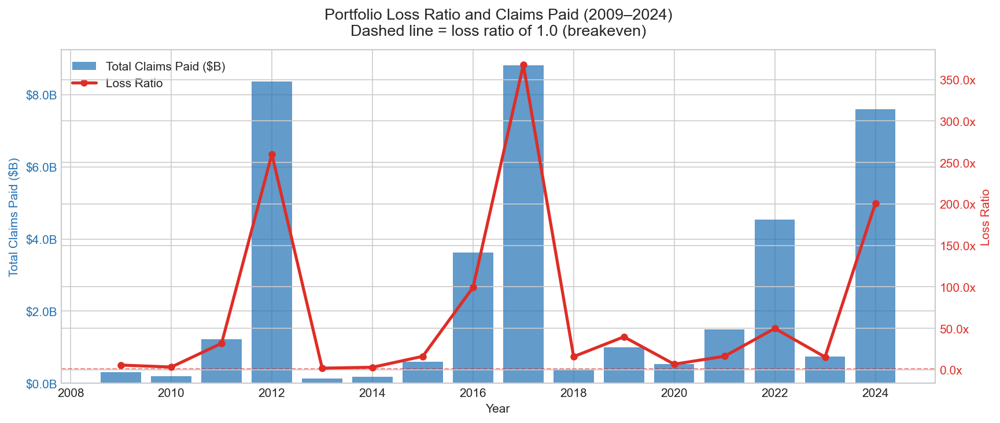
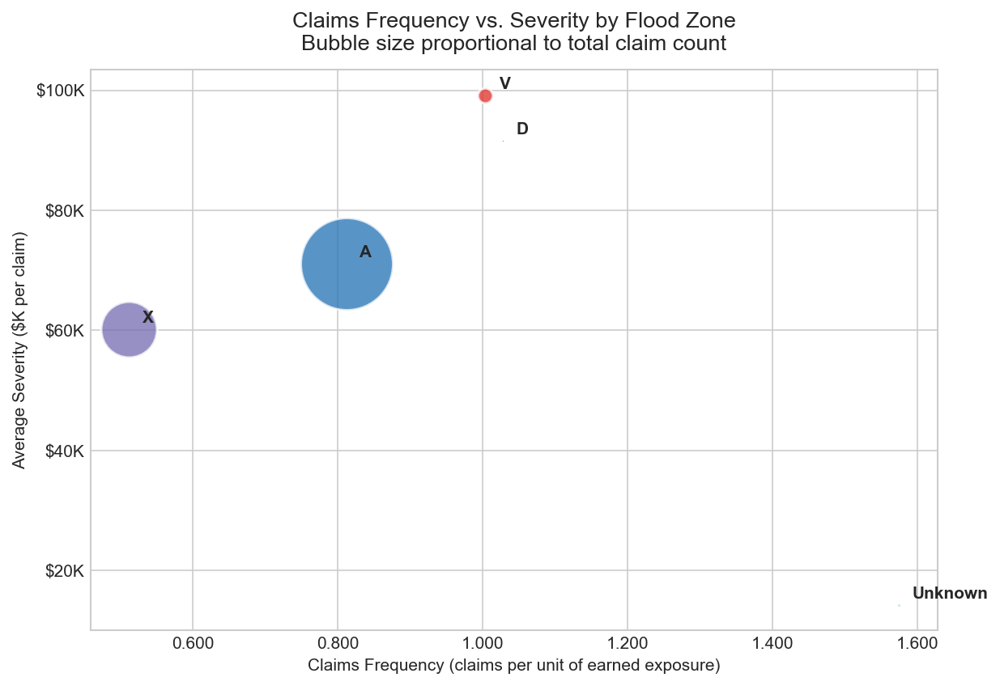
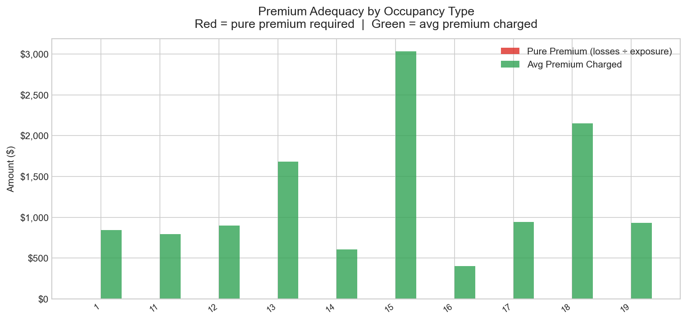

# NFIP Insurance Data Warehouse

Insurance data warehouse built on FEMA(Federal Emergency Management Agency, a U.S. government agency within the Department of Homeland Security founded that coordinates responses to major disasters) National Flood Insurance Program (NFIP)
claims and policy data, ingested via REST API. Medallion Architecture
(Bronze, Silver, Gold) with a star schema dimensional model and insurance
KPI analytics views.

---

## Business Context

Insurers manage policies and claims through separate operational systems.
Policy administration records what was sold, to whom, and at what price.
Claims systems record what happened, how much was paid, and why. In practice,
these datasets live in different databases with different schemas, different
update cadences, and different owners. The gap between them is where most
insurance analytics problems start — you cannot calculate a loss ratio,
assess premium adequacy, or measure claims frequency without joining the two.

This project builds a warehouse that brings NFIP flood insurance claims and
policies into a single analytical model. The NFIP dataset was chosen for its
scale (2.7 million records across 5 states — 1.7M claims and 1M policies),
public availability (no API key required), and real-world relevance to
property and casualty insurance. The data covers claims dating back to 1978
and policies from 2009 onward, providing decades of loss history against a
meaningful book of business.

The scope is deliberately constrained to five high-exposure states — Florida,
Louisiana, Texas, New Jersey, and New York — which together account for the
majority of NFIP claims volume. This mirrors how an insurer would approach
portfolio segmentation: start with the concentrations that drive the most risk.
The architecture and analytics patterns here are directly transferable to
Australian general insurance contexts, including the 2022 flood events in
Queensland and New South Wales, and the ARPC cyclone reinsurance pool.

---

## Data Acquisition

Data is sourced from the [OpenFEMA API](https://www.fema.gov/about/openfema/api),
a public REST API that requires no authentication.

Two Python ingestion scripts handle the download:

- `fetch_nfip_claims.py` — claims from `FimaNfipClaims` endpoint
- `fetch_nfip_policies.py` — policies from `FimaNfipPolicies` endpoint

Each script uses `$filter` for state selection, `$select` to request only the
columns needed, and `$top`/`$skip` pagination at 10,000 records per page.
Retry logic (3 attempts with exponential backoff) and rate limiting (1-second
delay between calls) handle API reliability. A resume feature skips states
already loaded, so interrupted downloads pick up where they left off.

Example API call:

```
https://www.fema.gov/api/open/v2/FimaNfipClaims?$filter=state eq 'FL'&$select=dateOfLoss,state,countyCode,...&$top=10000&$skip=0
```

The resulting CSV files are saved to `datasets/claims/` and `datasets/policies/`
and are **gitignored** due to file size. See `datasets/README.md` for
reproduction instructions.

---

## Architecture


*End-to-end pipeline from REST API source to analytics-ready dimensional model.*

The warehouse follows a **Medallion Architecture** (Bronze → Silver → Gold),
running on Azure SQL Edge in Docker.

**Bronze — Raw staging layer.**
All source columns are loaded as `VARCHAR(255)` with no transformation. Data
is loaded via a Python pyodbc loader (`load_via_python.py`) that dynamically
creates Bronze tables based on actual API column headers — this proved
essential when OpenFEMA field names differed from documentation. BULK INSERT
scripts are retained for SQL Server Express/Developer Edition environments but
do not run on Azure SQL Edge. Metadata columns (`batch_id`,
`ingestion_timestamp`, `source_state`, `source_api_endpoint`) are appended
for lineage tracking.

**Silver — Cleaned and enriched layer.**
Type casting via `TRY_CAST`, `COALESCE` for null handling, deduplication via
`ROW_NUMBER()`, and derived columns including `amountPaidTotal`,
`zone_category`, `is_special_flood_hazard`, and `exposure` (policy term as a
fraction of a year, capped 0–1).

**Gold — Analytical layer.**
Star schema with two fact tables and five dimensions, plus seven analytics
views that answer specific insurance business questions.

---

## ETL Pipeline


*Three-layer transformation pipeline: Bronze ingestion → Silver cleansing → Gold dimensional model.*

---

## Star Schema


*Star schema with fact_claims and fact_policies joined to five conformed dimensions.*

### Fact Tables

| Table | Grain | Key Measures |
| --- | --- | --- |
| `fact_claims` | One row per deduplicated claim | `amount_paid_total`, `amount_paid_building`, `amount_paid_contents`, coverage limits |
| `fact_policies` | One row per deduplicated policy | `total_premium`, `exposure`, `building_coverage`, `contents_coverage` |

### Dimension Tables

| Table | Description |
| --- | --- |
| `dim_date` | Calendar dates 1978–2030 with fiscal year (Oct start) |
| `dim_location` | State + county FIPS with FEMA region |
| `dim_flood_zone` | Zone code mapped to category (A/V/X/D) with SFHA flag |
| `dim_building_type` | Construction class, floors, year-built band, elevated flag, basement type |
| `dim_occupancy` | NFIP occupancy type with residential flag |

---

## Key Analytics

Seven views in the Gold layer, each answering a specific underwriting or
actuarial question:

**vw_loss_ratio_by_state** — Which states are profitable? Loss ratio
(claims paid / premiums collected) by state and year.

**vw_claims_frequency_severity** — How does risk vary by flood zone? Claims
frequency (count / exposure) and average severity by zone category and year.

**vw_large_loss_concentration** — Where do catastrophic losses concentrate?
Flags claims above the 95th percentile and shows geographic concentration
by state.

**vw_severity_by_flood_zone** — How severe are losses across zone types?
Average and median severity with building vs. contents split by zone category.

**vw_premium_adequacy** — Are premiums covering expected losses? Compares
pure premium (losses / exposure) against average premium charged, by
occupancy and construction type.

**vw_claims_development** — How do losses develop over time? Simplified
accident-year view showing total paid, claim count, and average severity
by year of loss. *(Note: a true development triangle requires incremental
payment dates, which the NFIP dataset does not provide.)*

**vw_portfolio_summary** — What does the book look like year over year? One
row per year with total policies, exposure, premium, claims paid, loss ratio,
average severity, and YoY growth.

---

## Analytics

### Loss Ratio by State and Year



Heatmap of loss ratio (claims paid ÷ premium) by state and year. Red cells indicate years where claims exceeded premiums collected. Katrina (2005), Sandy (2012 — NJ/NY), and Harvey (2017 — TX) are clearly visible as loss spikes. Some state-year combinations show inflated ratios due to the 200K per-state policy API cap — a known constraint documented in `docs/data_quality_notes.md`.

---

### Claims Development by Accident Year



Bar chart of total claims paid (left axis, $B) and average severity per claim (right axis, $K) across 47 accident years from 1978 to 2024. Katrina 2005 produced 131,431 claims and $10.1B in total paid. Harvey 2017 produced the highest average severity on record at $90,735 per claim. The rising severity trend reflects increasing property values and more severe flood events over time.

---

### Large Loss Concentration by State



Share of total claims paid that comes from catastrophic losses — claims above the P95 threshold of $185,607. Florida accounts for 41.8% of all catastrophic loss dollars, Texas 31.3%, Louisiana 23.3%. This tail-driven concentration pattern is characteristic of flood insurance and directly influences catastrophe reinsurance structure and pricing.

---

### Severity by Flood Zone



Average claim severity split by building and contents damage, across the four NFIP flood zone categories. Zone V (coastal, storm surge) shows the highest building damage share at 88.5% of losses. Zone A (inland fluvial) averages $52,836. Zone X (moderate/minimal risk) averages $43,017 — a 19% reduction from high-risk zones, validating the SFHA classification as a meaningful pricing signal.

---

### Portfolio Summary (2009–2024)



Year-over-year total claims paid (bars, left axis) against loss ratio (line, right axis) for the policy period 2009–2024. The dashed line marks loss ratio = 1.0, the breakeven point. Loss ratios above 1.0 indicate years where NFIP paid out more than it collected in premium — the program's structural reliance on Treasury borrowing is visible in the catastrophe years.

---

### Claims Frequency vs. Severity by Flood Zone



Scatter plot decomposing portfolio loss by flood zone into frequency (claims per unit of earned exposure, x-axis) and average severity ($ per claim, y-axis). Bubble size is proportional to total claim volume. Zone A drives the highest frequency; Zone V (coastal) shows the highest severity per claim — a segmentation that validates the SFHA zone classification as a risk pricing signal.

---

### Premium Adequacy by Occupancy Type



Grouped bar chart comparing pure premium (total losses ÷ earned exposure, red) against the average premium charged (green) by occupancy type. Where the red bar exceeds green, premiums are insufficient to cover expected losses. Segments with no green bar indicate occupancy codes present in claims but absent from the policy sample — a data constraint documented in `docs/data_quality_notes.md`.

---

## Pipeline Results

These numbers reflect an actual end-to-end pipeline run against the
OpenFEMA API data:

| Metric | Value |
| --- | --- |
| Bronze claims loaded | 1,703,977 |
| Bronze policies loaded | 1,000,000 |
| Silver claims (after dedup + NULL filter) | 1,328,816 |
| Silver policies | 823,465 |
| Gold fact_claims | 1,329,004 |
| Gold fact_policies | 823,465 |
| dim_date rows | 19,358 (1978–2030) |
| dim_location entries | 469 |
| dim_flood_zone codes | 68 (normalised to 5 categories) |
| dim_building_type combinations | 787 |
| P95 large loss threshold | $185,607 |
| Largest accident year | 2005 (Katrina) — 131,431 claims, $10.1B paid |
| Highest avg severity year | 2017 (Harvey) — $90,735 per claim |

---

## Tech Stack

| Component | Technology |
| --- | --- |
| Data ingestion | Python 3, `requests`, `pandas`, `pyodbc` |
| Database | Azure SQL Edge (Docker container) |
| SQL dialect | T-SQL |
| Architecture | Medallion (Bronze / Silver / Gold) |
| Data model | Star schema |
| Diagrams | Draw.io / Eraser.io |
| Version control | Git / GitHub |

---

## How to Run

### Prerequisites

- Python 3.x
- Docker Desktop for Mac
- Azure Data Studio (recommended) or sqlcmd via Homebrew

### Install sqlcmd (for command-line execution)

```shell
brew tap microsoft/mssql-release https://github.com/microsoft/homebrew-mssql-release
brew install sqlcmd
```

### 1. Clone and set up Python

```shell
git clone https://github.com/ayusyagol11/nfip-insurance-data-warehouse.git
cd nfip-insurance-data-warehouse
python -m venv venv
source venv/bin/activate
pip install -r requirements.txt
```

### 2. Download the data

```shell
python scripts/ingest/fetch_nfip_claims.py
python scripts/ingest/fetch_nfip_policies.py
```

Claims takes approximately 10 minutes (1.7M records). Policies takes
approximately 8 minutes (1M records, capped at 200K per state). Both
scripts support resume — interrupted downloads pick up where they left off.

### 3. Start the database

```shell
docker-compose up -d
# or use the helper:
./scripts/docker_start.sh
```

### 4. Load Bronze data

```shell
# Bronze schema setup
./scripts/run_sql.sh scripts/bronze/01_create_database.sql
./scripts/run_sql.sh scripts/bronze/02_create_bronze_tables.sql

# Bronze data loading — Python loader required for Azure SQL Edge
python scripts/bronze/load_via_python.py
```

> **Note:** `03_load_claims.sql` and `04_load_policies.sql` use BULK INSERT,
> which is not supported on Azure SQL Edge. Use `load_via_python.py` instead.
> The BULK INSERT scripts are retained for SQL Server Express/Developer Edition.

### 5. Run the full SQL pipeline in one command

```shell
./scripts/run_all_sql.sh
```

This executes all 21 SQL scripts in order with error handling — Silver
cleaning, Gold dimensions, Gold facts, analytics views, and the full test
suite. Individual scripts can still be run via `run_sql.sh` if needed.

---

## Repository Structure

```
nfip-insurance-data-warehouse/
├── datasets/
│   ├── claims/                           # FL/LA/TX/NJ/NY_claims.csv (gitignored)
│   ├── policies/                         # FL/LA/TX/NJ/NY_policies.csv (gitignored)
│   └── README.md                         # Data acquisition instructions
├── docs/
│   ├── images/                           # Diagrams and analytics screenshots
│   │   ├── architecture_diagram.png
│   │   ├── star_schema_erd.png
│   │   ├── etl_flow_diagram.png
│   │   ├── screenshot_loss_ratio.png
│   │   ├── screenshot_large_loss.png
│   │   ├── screenshot_portfolio_summary.png
│   │   ├── screenshot_severity_zone.png
│   │   ├── screenshot_frequency_severity.png
│   │   ├── screenshot_premium_adequacy.png
│   │   └── screenshot_claims_development.png
│   ├── data_catalog.md                   # Gold layer table documentation
│   ├── data_profile_report.md            # Automated data profiling results
│   ├── data_quality_notes.md             # Known issues and resolutions
│   ├── insurance_glossary.md             # Insurance term definitions
│   ├── naming_conventions.md             # Project naming standards
│   └── DIAGRAMS.md                       # Diagram creation specs
├── scripts/
│   ├── ingest/
│   │   ├── fetch_nfip_claims.py          # Claims API ingestion
│   │   ├── fetch_nfip_policies.py        # Policies API ingestion
│   │   └── profile_data.py               # Data profiling script
│   ├── bronze/
│   │   ├── 01_create_database.sql        # Database and schema creation
│   │   ├── 02_create_bronze_tables.sql   # Raw staging tables
│   │   ├── 03_load_claims.sql            # BULK INSERT claims (SQL Server Express)
│   │   ├── 04_load_policies.sql          # BULK INSERT policies (SQL Server Express)
│   │   └── load_via_python.py            # Primary loader via pyodbc
│   ├── silver/
│   │   ├── 01_create_silver_tables.sql   # Typed, cleaned tables
│   │   ├── 02_clean_claims.sql           # Claims transformation
│   │   ├── 03_clean_policies.sql         # Policies transformation
│   │   ├── 04_create_lookups.sql         # Reference tables
│   │   └── 05_validate_silver.sql        # Silver validation checks
│   ├── gold/
│   │   ├── 01_create_gold_tables.sql     # Star schema DDL
│   │   ├── 02_load_dim_date.sql          # Date dimension
│   │   ├── 03_load_dim_location.sql      # Location dimension
│   │   ├── 04_load_dim_flood_zone.sql    # Flood zone dimension
│   │   ├── 05_load_dim_building_type.sql # Building type dimension
│   │   ├── 06_load_dim_occupancy.sql     # Occupancy dimension
│   │   ├── 07_load_fact_claims.sql       # Claims fact table
│   │   ├── 08_load_fact_policies.sql     # Policies fact table
│   │   └── 09_create_analytics_views.sql # 7 KPI views
│   ├── docker_start.sh                   # Start container + test connection
│   ├── run_sql.sh                        # Execute SQL file against container
│   └── run_all_sql.sh                    # Run full pipeline in one command
├── tests/
│   ├── test_row_counts.sql               # Pipeline row count validation
│   ├── test_referential_integrity.sql    # FK orphan checks
│   └── test_business_rules.sql           # Business rule validation
├── docker-compose.yml                    # Azure SQL Edge container
├── requirements.txt                      # Python dependencies
├── LICENSE                               # MIT License
└── README.md
```

---

## Related Projects

- [Predictive Claims Liability Model](https://github.com/ayusyagol11/claims-liability-predictor) — Tweedie regression pipeline estimating pure premium across 677k motor insurance policies
- [Macroeconomic Resilience in General Insurance](https://github.com/ayusyagol11) — Stress-testing insurance KPIs against ABS/RBA economic scenarios *(repository coming soon)*

---

## Author

**Aayush Yagol** — Insurance Data Analyst | Claims Advisor, Suncorp Group

*I build predictive models for insurance and risk — from the inside.*

- Portfolio: [aayushyagol.com](https://aayushyagol.com)
- LinkedIn: [linkedin.com/in/aayush-yagol-046874145](https://linkedin.com/in/aayush-yagol-046874145)
- GitHub: [github.com/ayusyagol11](https://github.com/ayusyagol11)

---

## License

This project is licensed under the MIT License. See [LICENSE](LICENSE) for details.